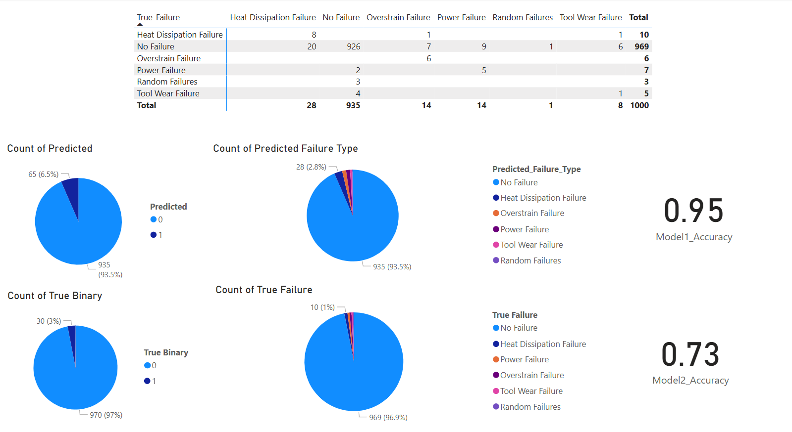

# Predicted-Maintanance

🚧 This project aims to build a predictive model that classifies:

- **Binary classification**: Whether a machine is going to fail (1 = fail, 0 = normal)
- **Multiclass classification**: The type of failure (0–5 classes)

---

## 📊 Results

| Model Type        | Accuracy |
|-------------------|----------|
| Binary Classifier | 90.2%    |
| Multiclass Classifier | 65.8% |

- Evaluated using:
  - Confusion matrix
  - Recall per class

📷 **Sample Power BI Dashboard**

> *(Add your Power BI screenshot below)*

---

## ⚙️ Techniques Used

- Neural Networks using **TensorFlow/Keras**
- `class_weight` to handle **imbalanced data**
- Performance evaluation using:
  - **Accuracy**
  - **Confusion matrix**
  - **Per-class recall**

---

## 💡 What I Learned

- Handling **imbalanced classification problems**
- Designing **multi-model architecture** (binary + multiclass)
- Evaluating models beyond simple accuracy

---

